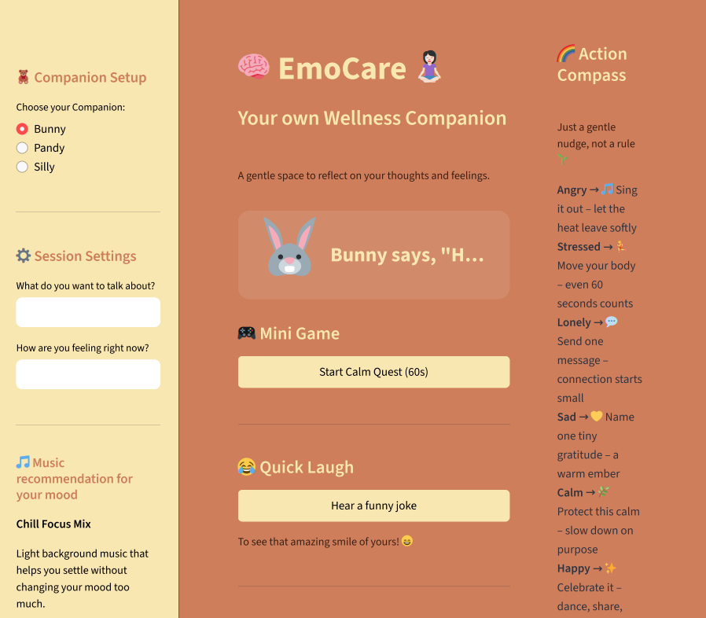
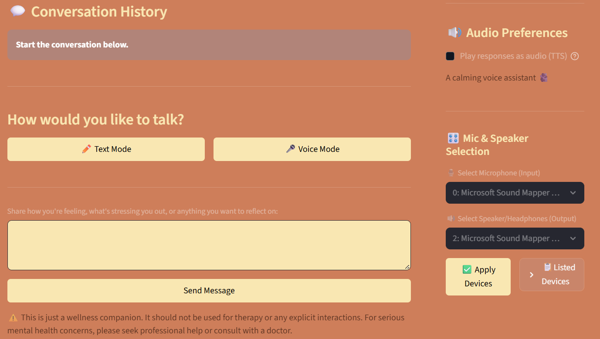

# 🧠 EmoCare: AI Wellness Companion 🧘🏻‍♀️

> *An AI-powered, empathetic conversational agent built to provide gentle support and a safe space for self-reflection.*

---

## 📌 Project Status
**Framework:** Complete ✅  
**Course:** Data 690 – Special Topics in AI  
**Tech Stack:** Streamlit · Groq · ElevenLabs  

---

## ✨ Overview

**EmoCare** is more than a chatbot — it’s a personalized wellness companion designed to help users process emotions, discover healthy coping strategies, and reflect mindfully in a **non-judgmental, supportive environment**.

This project was developed as part of **Data 690: Special Topics in AI**, under the guidance of **Prof. Levan Sulimanov**, with a focus on applying modern AI responsibly in the mental wellness domain.

---

## 🚀 Key Features

### 🎨 Custom Theming
- Warm, minimal, and calming UI  
- Built using **Streamlit custom CSS (`wellness.css`)** for a cozy wellness-focused experience

### 💬 Conversational AI
- Powered by **Groq’s high-speed LLM API (Llama 3.1)**  
- Delivers fast, empathetic, and context-aware responses  
- Adapts replies based on user-selected **mood** and **focus area**

### 🎙️ Voice Mode (STT & 🔊 TTS)
- Hands-free interaction via **ElevenLabs**
- **Speech-to-Text (STT)** for voice input  
- **Text-to-Speech (TTS)** for natural, calming voice responses

### 📖 Personalized Context
- Upload personal **journal / notes PDFs**
- EmoCare uses them as contextual grounding  
- Auto-generated **Word Cloud** for visual emotional insights

### 🧭 Action Compass
- Dynamic sidebar offering **gentle, mood-based nudges**
- Example:  
  > *Angry → 🎵 Sing it out*

### 🌿 Calm Quest Mini‑Game
A 60‑second guided reset consisting of:
1. 🫁 Breathing timer  
2. 🎯 Focus exercise  
3. ✍️ One-line journaling prompt  

### 🎧 Mood‑Based Music
- Curated **YouTube playlist recommendations**
- Automatically matched to the user’s selected mood

---

## 🛠️ Installation & Setup

### 1️⃣ Clone the Repository
```bash
git clone <your-repo-link>
cd emacare
```

### 2️⃣ Install Dependencies
```bash
pip install -r requirements.txt
```
> ⚠️ Requires **ffmpeg** to be installed for `ffmpeg-python`

### 3️⃣ Configure Environment Variables
Create a `.env` file in the root directory:
```env
GROQ_API_KEY=gsk_...
ELEVENLABS_API_KEY=sk_...
```

**API Usage**
- `GROQ_API_KEY` → Core conversational LLM logic  
- `ELEVENLABS_API_KEY` → Voice Mode (STT & TTS)

### 4️⃣ Run the Application
```bash
streamlit run wellness.py
```

---

## 🐛 Troubleshooting & Solutions

| Problem Encountered | Solution |
|-------------------|----------|
| **ElevenLabs TTS Output Stream** | SDK sometimes returns a generator instead of bytes. Fixed using:<br>`b"".join(chunk for chunk in audio_result)` |
| **ElevenLabs STT Model ID** | Transcription failed with generic IDs. Explicitly used **`scribe_v1`**, optimized for STT |
| **sounddevice Device Selection** | Stored device IDs in `st.session_state` and set:<br>`sd.default.device = (input_id, output_id)` |
| **Streamlit Button Reruns** | Required immediate state updates and `st.rerun()` for UI step transitions |

---

## 🖼️ UI & Response Examples

### 💬 EmoCare Response Example

**User (Voice):**  
> *"I feel like I have too much on my plate this week. My boss gave me two huge deadlines and I haven't slept well."*

**EmoCare:**  
> *"That sounds like a heavy load to carry right now. It’s completely understandable that you’re feeling overwhelmed and losing sleep. Your worth isn’t tied to productivity. Could you try one small act of self‑care — maybe stepping away for 90 seconds and stretching? Is there one meeting you could postpone or one small task you could delegate to give yourself a little more room to breathe?"*

---

### 🧭 Action Compass Example

When the user selects **Stressed / Overwhelmed**, EmoCare highlights:

```html
<div class="compass-swatch active">
  <b>Stressed</b> → 🏃 Move your body – even 60 seconds counts
</div>
```

---
🖼️ App Interface Preview

A glimpse into EmoCare’s calming, voice-enabled, and user-centric wellness experience.

<p align="center">    </p>

---

## 🙏 Acknowledgements

- **Prof. Levan Sulimanov**  
  For the academic framework and inspiration to explore ethical AI in mental wellness  

- **Groq**  
  For blazing-fast LLM inference enabling real-time, supportive conversations  

- **ElevenLabs**  
  For high-quality Speech-to-Text and Text-to-Speech APIs  

- **Streamlit**  
  For making it possible to build a professional-grade AI web app entirely in Python  

---

🌱 *Built with empathy, responsibility, and human-centered AI in mind.*
